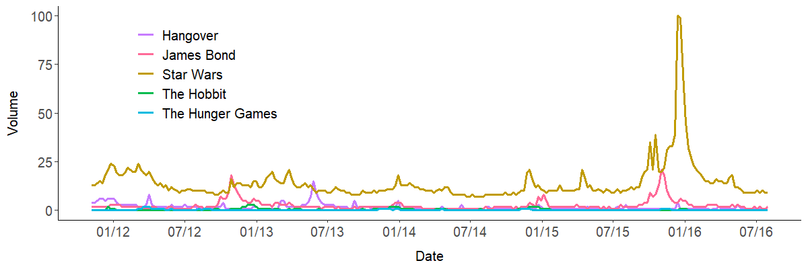
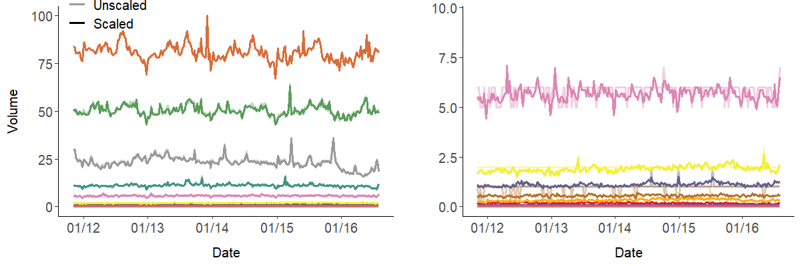

# Forecasting Box Office success based on Google Trends data

**Predicting  the amount of people watching a movie on the opening weekend in german cinemas by using meta information
of the movies linked with Google Trends data of search terms like the title of the movie or general terms like "Kino" 
(german for cinema). Models used for predition are additive regression models as well as boosting models.**

### Background
Inspired by a [whitepaper by Google](http://dl.icdst.org/pdfs/files1/350427db54ce5dcf1e46ad7f00d2e2cf.pdf) the models
fitted in this reposititory try to predict the amount of moviegoers for specific movies on their opening weekend.
In this paper Google is presenting several linear regression that make use of search volume of several movie related 
search terms to predict the amount of people going to the movies. These models reach a R2 of 58% one week before
premiere and 70% one day before premiere which shall be the baseline for this repository.

### Data gathering, -preprocessing and descriptive analysis
The provided dataset contains key data for 900 movies that premiered in Germany between 01/03/2013 and 07/07/2016. It contains 46 features of the movies like age rating, genre, studio as well as the number of ordered copies which is referring to the number of cinemas in which a movie is presented and the number of visitors of the movies on the first weekend. The number of visitors is the target which will be forecasted.

Capturing the popularity of a movie on Google Search is a hard task mainly due to 2 facts. First, movie titles are not always nonambiguous meaning that a search for *Django Unchained* will almost certainly lead you to a result linked to the Tarantino movie, whereas, a search for a Biopic like *Hitchcock* might result in a Webpage about the director itself. Second, the search volume information of a search term on Google is not publicly available in an evaluable form, meaning that Google Trends (which will serve as the main data source) only offfers natural numbers whereby, the maximum value in the observed time window is scaled to 100, which makes it impossible to compare a movie like *Star Wars - The force awakens* to an independent movie like *Flores Raras*, because the volume for *Flores Raras* will mostly if not always be scaled to 0. Therefore, the main task in gathering the search request data and calculating the popularity KPIs was two-sided:

1. Making sure, that the provided requests refer to the movie and nothing but the movie
2. Getting comparable real valued data for all movies from arthouse movies to blockbusters

To get a single KPI that captures the people's interest in a movie a linear combination of 3 possible search terms is defined. These search terms are the main title of the movie (e.g. *The Hobbit*), the main title of the movie + the suffix *film* (german for *movie*) and the complete title (e.g. *The Hobbit: An unexpected Journey*). The Google Trends data is gathered using the Pseudo API of [``gtrendsR``](https://cran.r-project.org/web/packages/gtrendsR/index.html), whereby, 5 search terms can be drawn at the same query. According to this [medium article](https://medium.com/google-news-lab/what-is-google-trends-data-and-what-does-it-mean-b48f07342ee8#.3efc7z5l9) the following transformations are applied for search term in a query: The absolute search volume at each time for the search term is devided by the overall(!) search volume for the given time. After this the data is normalized to a natural number range from 0 to 100 whereby, the relative maximum value of the five transformed query results is scaled to 100. This results in uncompareable numbers which makes a prediction unfeasible.

The following plot shows the Google Trend data for five famous franchises over time.

 

The plot not only shows the problems mentioned above but also another crucial circummstance that often arises when searching for famous franchises: Since these movies are so popular they tend to have a high search volume even in times no new movie of the franchies is about to premiere. Nevertheless, we are only interested in the search volume generated through the premiere of the new movie, and not the general interest in the movie franchise itself.

To counteract the difficulties above the construction of a so called *Google Value*, which should server as our KPI mentioned above, is necessary. To construct this Google Value 3 main steps are necessary:

1. Define a list of anchor terms to link search terms of differend volume levels
2. Normalize the search volume for each search term by substracting the median of the search volume within the time period before prediction
3. Build the Google Value as linear combination of the 3 search terms (main title, main title + film, complete title)

For step 1. it is mandatory to define a list of anchor terms whose search volume is as constant as possible over time to prevent disturbed standarization of the search terms. A good choice for such terms are cities or news papers. starting from bigger citiesand continuing to lokal newspapers. The first anchor is standardized by its own median to get the first *Scaling Factor*:

$SF_{1} = \frac{anchor_{1}}{med(anchor_{1})}$

To linke each search term to the median of the first anchor it is necessary to link the anchors top down. For this pupose one calculates the *Scaling Factor* as quotient of the search volumina of one anchor and the next lower anchor term. The general formula for the scaling factor is given by:

$SF_i = SF_{i-1} \cdot anker_{i-1}^i = \frac{\prod_{j=0}^{i-2}anker_{i-j-1}^{i-j}}{med(anker^1)} \hspace{1cm}\quad \forall i >1$

To make movies like *Star Wars - the force awakens* and *Flores Raras* comparable the search terms are drawn and linked to the anchor words top down. So in a first step the search terms are drawn with first anchor and scaled with its Scaling Factor. If maximum scaled seach volume of a search term within the time window of interest is below  0.25 it has to be redrawn with the next lower anchor term.

The result of the linked anchor terms are depicted below, whereby the right plot is just a zoom in on low level anchor terms:

It can be easily seen, that the scaled anchor terms are much more accurate than the unscaled ones and enable us to compare searcht terms of block busters to ones of smaller independent movies.

