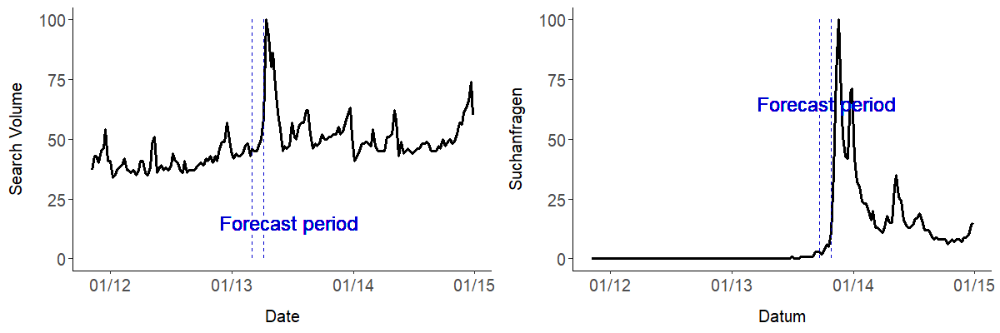

# Forecasting Box Office success based on Google Trends data

**Predicting  the amount of people watching a movie on the opening weekend in german cinemas by using meta information
of the movies linked with Google Trends data of search terms like the title of the movie or general terms like "Kino" 
(german for cinema). Models used for predition are additive regression models as well as boosting models.**

### Background
Inspired by a [whitepaper by Google](http://dl.icdst.org/pdfs/files1/350427db54ce5dcf1e46ad7f00d2e2cf.pdf) the models
fitted in this reposititory try to predict the amount of moviegoers for specific movies on their opening weekend.
In this paper Google is presenting several linear regression that make use of search volume of several movie related 
search terms to predict the amount of people going to the movies. These models reach a R2 of 58% one week before
premiere and 70% one day before premiere which shall be the baseline for this repository.

### Data gathering, -preprocessing and descriptive analysis
The provided dataset contains key data for about 900 movies that premiered in Germany between 01/03/2013 and 07/07/2016. It contains 100 features of the movies like age rating, genre, studio as well as the number of ordered copies which is referring to the number of cinemas in which a movie is presented and the number of visitors of the movies on the first weekend. The number of visitors is the target which will be forecasted.

After preprocessing of the raw movie data is done in [this script](preprocessing/preprocess_movies_data.R) the Google Trends data will be collected and preprocessed.

Capturing the popularity of a movie on Google Search is a hard task mainly due to 2 facts. First, movie titles are not always nonambiguous meaning that a search for *Django Unchained* will almost certainly lead you to a result linked to the Tarantino movie, whereas, a search for a Biopic like *Hitchcock* might result in a Webpage about the director itself. Second, the search volume information of a search term on Google is not publicly available in an evaluable form, meaning that Google Trends (which will serve as the main data source) only offfers natural numbers whereby, the maximum value in the observed time window is scaled to 100, which makes it impossible to compare a movie like *Star Wars - The force awakens* to an independent movie like *Flores Raras*, because the volume for *Flores Raras* will mostly if not always be scaled to 0. Therefore, the main task in gathering the search request data and calculating the popularity KPIs was two-sided:

1. Making sure, that the provided requests refer to the movie and nothing but the movie
2. Getting comparable real valued data for all movies from arthouse movies to blockbusters

To get a single KPI that captures the people's interest in a movie a linear combination of 3 possible search terms is defined. These search terms are the main title of the movie (e.g. *The Hobbit*), the main title of the movie + the suffix *film* (german for *movie*) and the complete title (e.g. *The Hobbit: An unexpected Journey*). The Google Trends data is gathered using the Pseudo API of [``gtrendsR``](https://cran.r-project.org/web/packages/gtrendsR/index.html), whereby, 5 search terms can be drawn at the same query. According to this [medium article](https://medium.com/google-news-lab/what-is-google-trends-data-and-what-does-it-mean-b48f07342ee8#.3efc7z5l9) the following transformations are applied for search term in a query: The absolute search volume at each time for the search term is devided by the overall(!) search volume for the given time. After this the data is normalized to a natural number range from 0 to 100 whereby, the relative maximum value of the five transformed query results is scaled to 100. This results in uncompareable numbers which makes a prediction unfeasible.

The following plot shows the Google Trend data for five famous franchises over time.

The plot not only shows the problems mentioned above but also another crucial circummstance that often arises when searching for famous franchises: Since these movies are so popular they tend to have a high search volume even in times no new movie of the franchies is about to premiere. Nevertheless, we are only interested in the search volume generated through the premiere of the new movie, and not the general interest in the movie franchise itself.

To counteract the difficulties mentioned above the construction of a so called *Google Value*, which should serve as our KPI, is necessary. To construct this Google Value 3 main steps are necessary:

1. Define a list of anchor terms to link search terms of differend volume levels and scale the search volume of the search terms according to these levels
2. Normalize the search volume for each search term by substracting the median of the past 52 weeks before the forecast period
3. Build the Google Value as linear combination of the 3 search terms (main title, main title + film, complete title)

For step 1. it is mandatory to define a list of anchor terms whose search volume is as constant as possible over time to prevent disturbed standarization of the search terms. A good choice for such terms are cities or news papers. starting from bigger cities and continuing to lokal newspapers. The first anchor is standardized by its own median to get the first *Scaling Factor*:

To link each search term to the median of the first anchor it is necessary to link the anchors top down. For this pupose one calculates the *Scaling Factor* as quotient of the search volumina of one anchor and the next lower anchor term. The general formula for the scaling factor is given by:

1" title="SF_i=SF_{i-1}\cdot anchor_{i-1}^i=\frac{\prod_{j=0}^{i-2}anchor_{i-j-1}^{i-j}}{med(anchor^1)} \hspace{1cm}\quad\forall i>2" />

To make movies like *Star Wars - the force awakens* and *Flores Raras* comparable the search terms are drawn and linked to the anchor words top down. So in a first step the search terms are drawn with first anchor and scaled with its Scaling Factor. If the maximum scaled seach volume of a search term within the time window of interest is below 25% of the scaled anchor it has to be redrawn with the next lower anchor term.

The scaled search volume is now given as  where  is the Scaling Factor of the anchor term which produced results of the search term that were great enough (> 25% of the scaled anchor).

The result of the linked anchor terms (and so the Scaling Factors) are depicted below, whereby the right plot is just a zoom in on low level anchor terms:

Especially in the right plot it can be seen, that the scaled anchor terms are much more accurate than the unscaled ones and enable us to compare searcht terms of block busters to ones of smaller independent movies. Google trends data collection of the anker terms and the calculation of the scaling factors is done in [this script](preprocessing/collect_gt_data_ankers.R). The collection of the Google Trends data for the search terms as well as the scaling is done in [this script](preprocessing/collect_gt_data_movies.R)

To capture the impact of a movie premiere for ambigiuous movie titles the scaled search volume will be normalized according to 2. The following plot clearifies why this is necessary.

While the left plot shows the seach volume for the quite amiguous movie title [*Mama*](https://en.wikipedia.org/wiki/Mama_(2013_film)), the right one shows the seach volume for the term [*Fack Ju Göhte*](https://en.wikipedia.org/wiki/Fack_ju_G%C3%B6hte). Taking a look at the seach volume of *Mama* it appears, that the requests for this seach term do not really increase during the forecast period compared to previous peaks, but the days after it and normalizes some time after the premiere. One the other hand the search volume for *Fack Ju Göhte*, which was unexpected succesfull and produced two more successors, is not decreasing to the level before the premiere. These two examples show why substracting the median of the search volume *before* the forecast period is necessary. This is done in the [preprocessing script](preprocessing/preprocess_gt_data.R) that should be executed after the collection of the Google Trends data.

After substracting the median for each seach term we need to melt the 3 search terms for each movie to a single KPI (Google Value *gv*) by applying a linear transformation. To do so we'll melt the search volumina of the main title (*mt*) and main title + "film" (*mtf*) to a single value. If the movie has a subtitle we'll take the search volume of the complete title (*ct*) into consideration in a second step. The resulting linear combination should maximize the correlation between the Google Value and the amount of visitors:

We'll do this for each week . To prevent overfitting of the weights a nested resampling approach is applied and the resulting weights are averaged. To prevent values of 0, the Google Value will be [Box-Cox transformed](https://en.wikipedia.org/wiki/Power_transform#Box%E2%80%93Cox_transformation) afterwards. Optimization of the weights for the Google Value as well as their application to calculate the final KPI is done in [this script](preprocessing/calculate_google_values.R). This script also splits the data in a train and test set to prevent overfitting on the optimization results.

After the data is gathered and preprocessed, descriptive analysis is mostly done by the notebooks in [the data analysis directory](data_analysis)