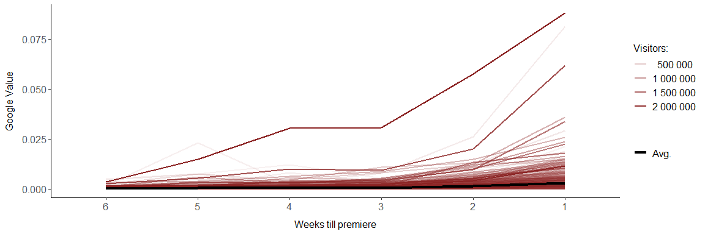
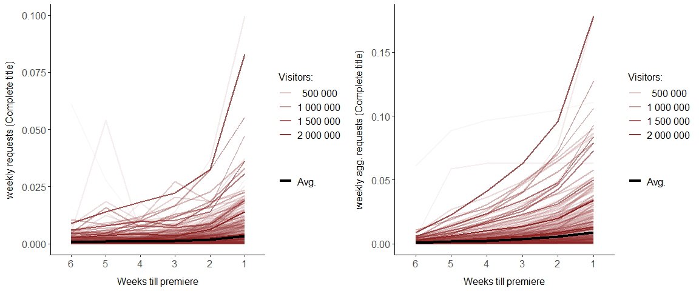
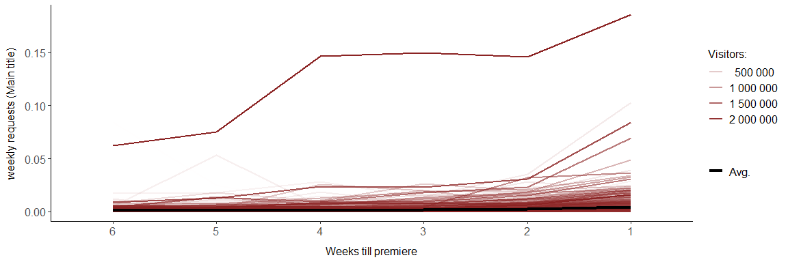
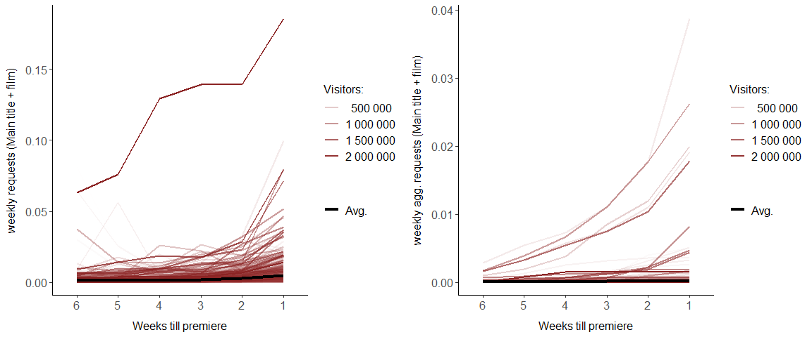
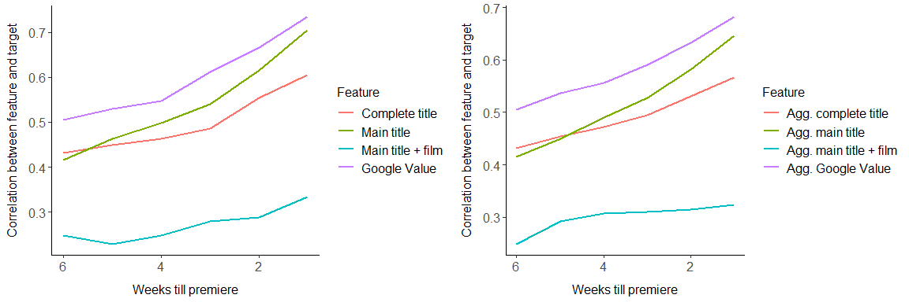

Requests Analyis
================

***This notebook mainly shows the relation between the target and the
Google requests of the movie title***

``` r
load("../data/data_final.RData")
source("../utils/preprocessing_utils.R")
source("../utils/plotting_utils.R")
```

Data extraction:

``` r
target = data_final$visitors_premiere_weekend
target_log = data_final$visitors_premiere_weekend_log
google_value = data_final[, paste0("week", 6:1)]
aggregation_google_value = data_final[, paste0("aggregation", 6:1)]
google_value_transformed = data_final[, paste0("week", 6:1, "_transformiert")]
aggregation_google_value_transformed = data_final[, paste0("aggregation", 6:1, "_transformiert")]
main_title = data_final[, paste0("week", 6:1, "_main_title")]
main_title_film = data_final[, paste0("week", 6:1, "_main_title_film")]
aggregation_main_title_film = data_final[, paste0("aggregation", 6:1, "_main_title_film")]
aggregation_main_title = data_final[, paste0("aggregation", 6:1, "_main_title")]
complete_title = data_final[, paste0("week", 6:1, "_complete_title")]
aggregation_complete_title = data_final[, paste0("aggregation", 6:1, "_complete_title")]
```

Let’s take a look at the devolpment of the calculated Google Value from
the start of the time series (6 weeks prior to premiere) until its end
(1 week prio to premiere).

``` r
requests = t(google_value)
colnames(requests) = data_final$Filmtitel
alpha_var = rep(x = target, each = 6)
plot_requests(requests, y = "Google Value", alpha = alpha_var, names = c("Date", "Movie", "Req"))
```

<!-- -->

The weekly values of the Google Value tend to increase until the
premiere. The darker the color of a line, the more people eventually
watched the movie. The black line depics the average of the Google
Values of all movies. It can be easily seen that the calculated Google
Values increases towards premiere. The highest increase is 2 weeks
before premiere. The line dominating each other ith a gogle Vale far abe
0.025 is *Star Wars* which has a steadily high request rate due to its
ambiguity.

``` r
requests = t(complete_title)
colnames(requests) = complete_title$title
alpha_var = rep(x = target, each = 6)
plot_requests(requests, y = "weekly requests (Complete title)", alpha = alpha_var, names = c("Date", "Movie", "Req"))
```

<!-- -->

This images continues if one takes a look to the request numbers of the
complete title of the movies. Whereby, some complete titles tend to
stagnate about 4 weeks before their premiere. One assumption - which
will be later confirmed by the models - is, that as soon as a search
termn gathers momentum at Google Search it is not necessary anymore to
search for the full title but just for the main title. The time of
momentum gatherin seems to be around 4 to 3 weeks of a movies premiere.

``` r
requests = t(main_title)
colnames(requests) = data_final$Filmtitel
alpha_var = rep(x = target, each = 6)
plot_requests(requests, y = "weekly requests (Main title)", alpha = alpha_var,names = c("Date", "Movie", "Req"))
```

<!-- -->

Taking a look at the main title shows a very similar image to the
overall Google Value.

If one takes a look at the numbers of the search term main title with
the suffix “film” she will notice, that blockbusters to not have high
numbers for requests with this suffix. This might be due to the fact,
that it’s simply not necessary to add this suffix to search requests on
very populat movies. It is simply not necessary to add “film” to a
search request “Mission Impossible”, whereas if the movie has become a
brand like Star Wars or Lord of the Rings it might become necessary
again.

``` r
requests = t(main_title)
colnames(requests) = data_final$Filmtitel
alpha_var = rep(x = target, each = 6)
plot_requests(requests, y = "weekly requests (Main title + film)", alpha = alpha_var, names = c("Date", "Movie", "Req"))
```

<!-- -->

Now let’s take a look at the correlations between the target feature and
the request KPIs. Herefore, it is neccessary to calculate these
corrleations:

``` r
cor_google_value = cor(x = google_value_transformed, y = target_log)
cor_aggregation_google_value = cor(x = aggregation_google_value_transformed, y = target_log)

# Small utility function
calc_corr_with_bc = function(x, y){
  for(i in 1:ncol(x)) {
    boxcox = estimate_box_cox(x[, i])
    x[, i] = boxcox$google_value
  }
  return(cor(x = x, y = y))
}

cor_complete_title = calc_corr_with_bc(complete_title, target_log)
cor_aggregation_complete_title = calc_corr_with_bc(x = aggregation_complete_title, y = target_log)
cor_main_title = calc_corr_with_bc(main_title, target_log)
cor_aggregation_main_title = calc_corr_with_bc(x = aggregation_main_title, y = target_log)
cor_main_title_film = calc_corr_with_bc(main_title_film, target_log)
cor_aggregation_main_title_film = calc_corr_with_bc(x = aggregation_main_title_film, y = target_log)
```

The following plots show the correlation between the KPIs and the target
feature over time.

``` r
tmp = data.frame(cor_complete_title, cor_main_title, cor_main_title_film, cor_google_value, c(6: 1))
names(tmp) = c("Complete title", "Main title", "Main title + film", "Google Value", "Weeks")
tmp = melt(tmp, id.vars = "Weeks")
p1 = ggplot(data = tmp) + geom_line(aes(x = Weeks, y = value, col = variable,  group = variable), size = 1) + 
  labs(x="Weeks till premiere", y="Correlation between feature and target") + scale_x_reverse() + 
  scale_color_discrete(name="Feature") + stat_con

tmp = data.frame(cor_aggregation_complete_title, cor_aggregation_main_title, cor_aggregation_main_title_film,
                 cor_aggregation_google_value, c(6: 1))
names(tmp) = c("Agg. complete title", "Agg. main title", "Agg. main title + film", "Agg. Google Value", "Weeks")
tmp = melt(tmp, id.vars = "Weeks")
p2 = ggplot(data = tmp) + geom_line(aes(x = Weeks, y = value, col = variable,  group = variable), size = 1) + 
  labs(x="Weeks till premiere", y="Correlation between feature and target") + scale_x_reverse() + 
  scale_color_discrete(name="Feature") + stat_con
grid.arrange(p1, p2, ncol=2)
```

<!-- -->

There does not seem to be any obvious difference between the KPIs and
their cummulative aggregation, except for the aggregated volume of the
search term “main title + film” whose correlation stagnates at about 3
weeks before premiere. Nevertheless, the Google Value, the complete
title and the main title show a high correlation between compared to the
number of visitors. Also notice: 6 and 5 weeks before premiere the
correlation between the complete title and the number of visitors is
greater than the correlation between the main title and the number of
visitors, which kind of confirms the assumption made above, that up to 4
week prior to premier it is neceassary to google for the complete title
and not just the main title if one wants to find sufficient results.
